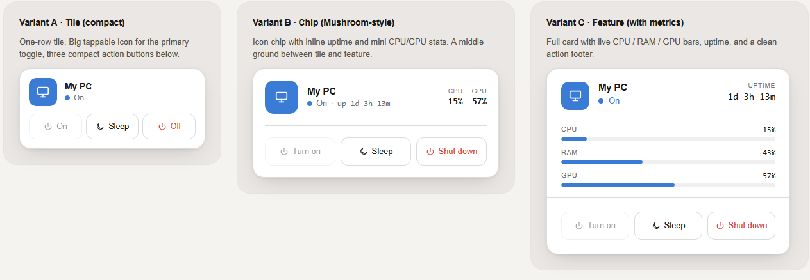

# PC Control Card

A Home Assistant Lovelace custom card for controlling a PC or NAS — **turn on, sleep, shutdown** — with live CPU / RAM / GPU / storage metrics.



**▶ [Live demo](https://solst1cee.github.io/HA-PC-control-card/)**

Three variants in one file:

- **`tile`** — compact, fits in a small dashboard slot. Tap the icon to toggle, or use the 3 action buttons below.
- **`chip`** — Mushroom-style: icon chip + inline status + uptime, with mini CPU/GPU stats when the PC is on.
- **`feature`** — full card with CPU / RAM / GPU / storage progress bars, uptime, and a clean action footer.

All three variants follow your active Home Assistant theme (light & dark) via standard CSS variables. No build step. No external dependencies. Single JS file.

---

## Install

### Option A — HACS (recommended)

[](https://my.home-assistant.io/redirect/hacs_repository/?owner=Solst1cee&repository=HA-PC-control-card&category=plugin)

1. In HACS, open the kebab menu (top-right) → **Custom repositories**
2. Add `https://github.com/Solst1cee/HA-PC-control-card` as type **Dashboard** *(older HACS versions label this "Lovelace" or "Plugin" — same category)*
3. Find **PC Control Card** in the HACS frontend list and install
4. **Hard refresh** your browser (Ctrl/Cmd + Shift + R)

HACS adds the resource automatically. If your dashboard is YAML-managed, add it yourself:

```yaml
resources:
  - url: /hacsfiles/HA-PC-control-card/pc-control-card.js
    type: module
```

### Option B — Manual

1. Download `pc-control-card.js` from the [latest release](https://github.com/Solst1cee/HA-PC-control-card/releases)
2. Copy it to your HA config at `/config/www/pc-control-card.js`
3. Go to **Settings → Dashboards → ⋮ → Resources → Add Resource**
   - URL: `/local/pc-control-card.js?v=1`
   - Resource type: **JavaScript Module**
4. **Hard refresh** your browser

If you update the file later, **hard refresh** again — HA aggressively caches frontend resources. (Power users can also bump a `?v=` query on the resource URL to force a cache-bust.)

---

## Usage

Edit your dashboard → **Add card → Manual** → paste one of the snippets below.

### Tile (compact)

```yaml
type: custom:pc-control-card
variant: tile
name: My PC                                # heading shown on the card
status_entity: binary_sensor.YOUR_PC_PING  # a sensor that's `on` when the PC is reachable (ping, agent heartbeat, WOL switch state, ...)
turn_on:  switch.YOUR_PC_WOL               # the entity that wakes the PC — WOL switch, script, etc.
sleep:    button.YOUR_PC_SLEEP             # a button/script your PC agent exposes for sleep
shutdown: button.YOUR_PC_SHUTDOWN          # a button/script your PC agent exposes for shutdown
confirm_shutdown: true                     # default — set false for single-tap shutdown
confirm_sleep: false                       # set true to require 2-tap confirm on sleep too
```

### Chip (Mushroom-style)

```yaml
type: custom:pc-control-card
variant: chip
name: My PC
status_entity: binary_sensor.YOUR_PC_PING
turn_on:  switch.YOUR_PC_WOL
sleep:    button.YOUR_PC_SLEEP
shutdown: button.YOUR_PC_SHUTDOWN
confirm_shutdown: true
confirm_sleep: false
metrics:
  cpu: sensor.YOUR_PC_CPU_PERCENT  # optional — shown inline next to the status
  ram: sensor.YOUR_PC_RAM_PERCENT  # optional
  gpu: sensor.YOUR_PC_GPU_LOAD     # optional
  storages:                         # optional — first disk shown inline on chip
    - entity: sensor.YOUR_DISK_PERCENT
      name: System
```

### Feature (with metrics)

```yaml
type: custom:pc-control-card
variant: feature
name: My PC                                  # or "NAS" — same card works for both
status_entity: binary_sensor.YOUR_PC_PING    # `on` = device is reachable
turn_on:  switch.YOUR_PC_WOL                 # WOL / wake script
sleep:    button.YOUR_PC_SLEEP               # from your PC/NAS agent
shutdown: button.YOUR_PC_SHUTDOWN
confirm_shutdown: true
confirm_sleep: false

# Hide any individual metric. Useful for NAS (no GPU): show_gpu: false
show_cpu: true
show_ram: true
show_gpu: true
show_storage: true

metrics:
  cpu: sensor.YOUR_PC_CPU_PERCENT          # numeric % sensor
  ram: sensor.YOUR_PC_RAM_PERCENT          # used % — or used "GB" sensor if pairing with ram_total
  ram_total: sensor.YOUR_PC_RAM_TOTAL      # OPTIONAL: if set, RAM displays "used / total"
  gpu: sensor.YOUR_PC_GPU_LOAD
  storages:                                 # one entry per disk — supports any number
    - entity: sensor.YOUR_DISK_1_USED       # sensor (used) — numeric, units come from the sensor
      total: sensor.YOUR_DISK_1_TOTAL       # OPTIONAL: if set, displays "used / total"
      name: System                          # optional label (default: "Disk", "Disk 2", …)
    - entity: sensor.YOUR_DISK_2_PERCENT    # percent sensor — no total = percent display
      name: Media
```

> Replace every `YOUR_PC_*` placeholder with your own entity IDs. The `turn_on` entity is whatever you already use to wake the PC — most setups use a Wake-on-LAN switch from the [`wake_on_lan`](https://www.home-assistant.io/integrations/wake_on_lan/) integration, but a `script`, `input_button`, or any service-callable entity works.

You can mix both — drop the tile on a phone view and the feature card on a wall display, both pointing at the same entities.

### NAS / multi-disk setup

The same card works for a NAS — hide the GPU, add multiple disks:

```yaml
type: custom:pc-control-card
variant: feature
name: NAS
status_entity: binary_sensor.nas_status
turn_on:  switch.nas_wol
shutdown: button.nas_shutdown
show_sleep: false        # most NAS firmware doesn't expose sleep
show_gpu: false          # no GPU on a NAS
metrics:
  cpu: sensor.nas_cpu_percent
  ram: sensor.nas_ram_used
  ram_total: sensor.nas_ram_total       # display "X / Y GB"
  storages:
    - entity: sensor.nas_volume1_used
      total: sensor.nas_volume1_total
      name: Volume 1
    - entity: sensor.nas_volume2_used
      total: sensor.nas_volume2_total
      name: Volume 2
    - entity: sensor.nas_volume3_used
      total: sensor.nas_volume3_total
      name: Volume 3
```

---

## Configuration

| Key                | Required | Type                              | Default                  | Notes |
| ------------------ | -------- | --------------------------------- | ------------------------ | ----- |
| `variant`          | no       | `tile` \| `chip` \| `feature`     | `tile`                   | Layout |
| `name`             | no       | string                            | `"PC"`                   | Heading text |
| `status_entity`    | **yes**  | entity_id                         | —                        | A `binary_sensor` that reports `on` when the PC is reachable (ping / WOL / agent heartbeat / etc.) |
| `turn_on`          | no       | entity_id or `{entity, service}`  | —                        | Bare entity infers the service: `switch.*` → `switch.turn_on`, `button.*` → `button.press`, `script.*` → `script.turn_on`, `input_button.*` → `input_button.press`, `automation.*` → `automation.trigger` |
| `sleep`            | no       | same                              | —                        | Same |
| `shutdown`         | no       | same                              | —                        | Same |
| `confirm_shutdown` | no       | boolean                           | `true`                   | When true, shutdown requires a 2-tap confirm. Set `false` to fire on a single tap. |
| `confirm_sleep`    | no       | boolean                           | `false`                  | Set `true` to require 2-tap confirm on sleep too. |
| `show_turn_on`     | no       | boolean                           | `true`                   | Set `false` to hide the Turn on button. Remaining buttons grow to fill the row. |
| `show_sleep`       | no       | boolean                           | `true`                   | Set `false` to hide the Sleep button. |
| `show_shutdown`    | no       | boolean                           | `true`                   | Set `false` to hide the Shut down button. |
| `show_cpu`         | no       | boolean                           | `true`                   | Show the CPU metric (chip + feature). |
| `show_ram`         | no       | boolean                           | `true`                   | Show the RAM metric. |
| `show_gpu`         | no       | boolean                           | `true`                   | Show the GPU metric. Set `false` for NAS use. |
| `show_storage`     | no       | boolean                           | `true`                   | Show all disk rows. |
| `accent_color`     | no       | CSS color string                  | HA's `--primary-color`   | Override the accent for this card only (e.g. `"#7a5af8"`, `"#2f9e6e"`, `"oklch(0.65 0.18 145)"`). Different PCs can have different accents without touching your theme. |
| `metrics.cpu`      | no       | sensor entity                     | —                        | Feature: drives CPU bar. Chip: mini stat. |
| `metrics.ram`      | no       | sensor entity                     | —                        | Used value. Pair with `metrics.ram_total` for "used / total" display, otherwise treated as percent. |
| `metrics.ram_total`| no       | sensor entity                     | —                        | When present, RAM switches from percent to absolute display (e.g. `6.8 / 16 GB`). |
| `metrics.gpu`      | no       | sensor entity                     | —                        | GPU load or temperature — unit follows the sensor. |
| `metrics.storages` | no       | array of `{ entity, total?, name? }` | —                     | One entry per disk. `entity` is required (used or percent sensor). `total` is optional — if present, displays "used / total". `name` is the label shown in the feature variant (defaults to `Disk`, `Disk 2`, …). Supports any number of disks. |

If you need a specific service (e.g. `switch.toggle` instead of `switch.turn_on`):

```yaml
turn_on:
  entity: switch.my_pc
  service: switch.toggle
```

---

If you only need one or two of the action buttons — e.g. just Turn on, or just Shut down — hide the rest:

```yaml
type: custom:pc-control-card
variant: tile
name: My PC
status_entity: binary_sensor.YOUR_PC_PING
turn_on: switch.YOUR_PC_WOL
show_sleep: false      # hide
show_shutdown: false   # hide
```

The remaining buttons grow to fill the row.

### Per-card accent color

Give each PC its own color without touching your theme — set `accent_color` per card:

```yaml
type: custom:pc-control-card
name: Gaming PC
accent_color: "#7a5af8"   # purple
# …

type: custom:pc-control-card
name: Office PC
accent_color: "#2f9e6e"   # green
# …
```

Accepts any CSS color string (hex, `rgb()`, `oklch()`, color names). Omit it and the card falls back to HA's `--primary-color`.

---

## Behaviour

- **Visual editor** — when you add or edit the card from the dashboard UI (not raw YAML), you get a form with entity pickers for each action, a color picker for `accent_color`, toggles for the booleans, and a dropdown for `variant`. Drop into Manual mode if you prefer YAML.
- **State** is derived from `status_entity`. While an action is pending, the card overlays a transitional state (Booting / Shutting down / Sleeping) with a pulsing indicator and a spinner on the busy button.
- **Booting / Shutting**: cleared automatically when `status_entity` flips to the expected value (or after 90 s as a safety fallback).
- **Sleeping**: displayed for 6 s after pressing Sleep — your `binary_sensor` likely can't distinguish sleeping from off, so this is a short visual confirmation rather than a sustained state.
- **Confirmation**: when armed, the destructive button changes label ("Shut down" → "Confirm?"). Both labels share a CSS grid cell so the button width never shifts.
- **Uptime** in the feature variant is computed from `last_changed` of your status sensor.

---

## Theming

The card uses standard Home Assistant CSS variables, so light and dark themes work out of the box:

| CSS variable                  | Used for                       |
| ----------------------------- | ------------------------------ |
| `--primary-color`             | Accent (active icon, primary button background, metric bars) |
| `--card-background-color`     | Card background                |
| `--primary-text-color`        | Headings, button text          |
| `--secondary-text-color`      | Muted labels, status when idle |
| `--divider-color`             | Borders, button outlines       |
| `--error-color`               | Shutdown button text / armed tint |
| `--ha-card-border-radius`     | Card corner radius             |

To override the accent per-card (without changing your whole theme), you can use [`card_mod`](https://github.com/thomasloven/lovelace-card-mod) — a separate HACS plugin that lets you inject styles into any card:

```yaml
type: custom:pc-control-card
# …
card_mod:
  style: |
    :host { --primary-color: #7a5af8; }
```

`card_mod` is **optional** — the card works fine without it; you only need it if you want to override CSS variables for a single instance.

---

## Recommended companion integrations

- **Status sensor** — a `binary_sensor.ping` of the PC's LAN IP works great.
- **Turn on** — Wake-on-LAN (`wake_on_lan` integration → `switch` entity) or a script.
- **Sleep / shutdown** — an agent running on the PC that exposes buttons in HA. [HASS.Agent](https://github.com/LAB02-Research/HASS.Agent), [IOT Link](https://gitlab.com/iotlink/iotlink), or any MQTT-based shell command works.
- **Metrics** — same agents typically expose CPU / RAM / GPU as sensors.

---

## Development

Card is a single ES module. No build step.

```bash
git clone https://github.com/Solst1cee/HA-PC-control-card.git
# Edit pc-control-card.js
# Copy to /config/www/ or symlink during development
```

Bump `CARD_VERSION` in the file before tagging a release — or just push a tag and let `.github/workflows/release.yml` stamp it for you and attach the file to the GitHub Release.

---

## Troubleshooting

| Symptom                                        | Fix |
| ---------------------------------------------- | --- |
| **"Custom element doesn't exist: pc-control-card"** | Resource isn't loaded. Recheck the install step, hard-refresh. |
| **Card shows "—" for uptime**                   | Status sensor isn't `on`, or it was just created (`last_changed` is "now"). |
| **Metric bars stuck at 0**                     | Confirm the sensor entity IDs in **Developer Tools → States**. Values must be numeric. |
| **Buttons fire the wrong service**             | Set both `entity` and `service` explicitly (see Configuration above). |

---

## License

[MIT](LICENSE)

---

## Credits

Inspired by the layout of HA's built-in **Tile** card and the [Mushroom](https://github.com/piitaya/lovelace-mushroom) family.
